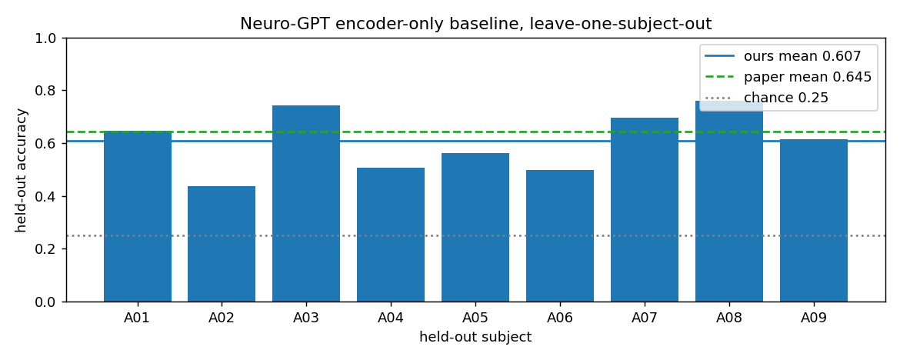
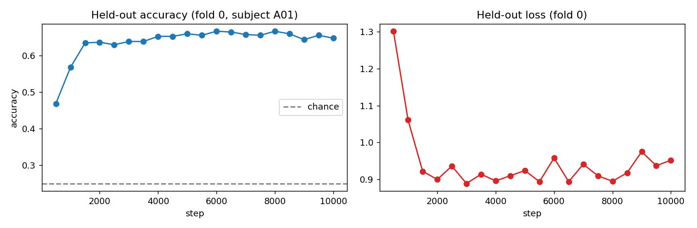

# Baseline: Neuro-GPT encoder-only, 9-fold leave-one-subject-out

Authors' code, unmodified. Recipe: `--ft-only-encoder=True`, 10,000 steps, batch 32, lr 1e-4, pretrained weights
from `wenhuic/Neuro-GPT`, BCI-IV-2a converted from raw GDF. Colab T4. Fold `i` holds out subject A0(i+1).

| Fold | Held-out subject | Final-step accuracy | Best-checkpoint accuracy (not used) |
|---|---|---|---|
| 0 | A01 | 0.648 | 0.667 |
| 1 | A02 | 0.438 | 0.464 |
| 2 | A03 | 0.743 | 0.750 |
| 3 | A04 | 0.507 | 0.528 |
| 4 | A05 | 0.562 | 0.608 |
| 5 | A06 | 0.498 | 0.530 |
| 6 | A07 | 0.696 | 0.717 |
| 7 | A08 | 0.759 | 0.762 |
| 8 | A09 | 0.615 | 0.632 |

| | Mean +/- std (ddof=1) |
|---|---|
| **Ours, final step (reported)** | **0.607 +/- 0.114** |
| Ours, best checkpoint (optimistic, test-set selected) | 0.629 |
| Paper, encoder-only, pre-trained (Table 1) | 0.645 +/- 0.104 |
| Paper, encoder-only, from scratch | 0.606 +/- 0.098 |
| Paper, linear probe, pre-trained | 0.443 +/- 0.051 |
| Paper, encoder+GPT, pre-trained | 0.586 +/- 0.098 |
| Chance | 0.250 |

Notes
- Accuracy is the held-out evaluation at the final step on the unseen subject. The repo's own `test_metrics.csv`
  is computed on the training subjects (dataset swap in `train_gpt.py` decoding mode) and is not used.
- Our mean is about 4 points below the paper's. The gap is a third of one standard deviation across subjects; the
  paper's own pre-trained-vs-scratch gap is 3.9 points. Differences in library versions (torch 2.11 vs the pinned
  2.2.0 in requirements.txt) and random seeds were not isolated.
- Environment pins needed on Colab: `transformers==4.38.1`, `tokenizers<0.19`, `accelerate==0.27.2`, `peft` removed.

